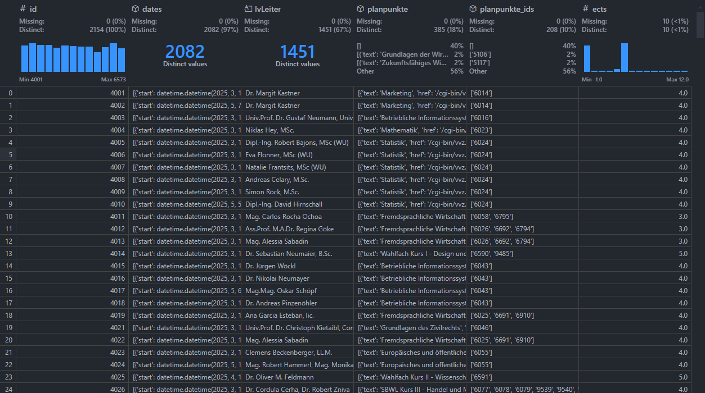
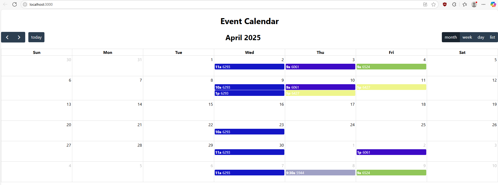

## Semesterplanoptimierung eines Studierenden der Wirtschaftsuniversität Wien im Hauptstudium 

Bachelorarbeit von Philipp SCHEER (h12242922)


### Vorgehensweise

- Datenbeschaffung
- Analyse (Implementierung)
- Nutzbarmachung (Visualisierung)


### Datenbeschaffung

Über das VVZ der WU wurden LV-ID, Datum, LV-Leiter und Planpunkte abgerufen und mit Daten von URL -> Planpunkt und Planpunkt -> ECTS kombiniert.

Die Daten wurden über folgende URL abgerufen:

```python
url = "https://vvz.wu.ac.at/cgi-bin/vvz.pl?C=S&LANG=DE&U=H&S=25S&LV=3&L2=S&L3=S&T=&L=&I=$lvid&JOIN=AND"
```

Wobei, `$lvid` mit der LV-ID in der URL mit einer Zahl von 1 bis 9999 ersetzt wurde.

Die Daten wurden in folgendem Format gespeichert:




### Analyse (Implementierung)

Ein Greedy- und LP-Algorithmus wurde implementiert mit folgenden Constraints:

- mind. 20 ECTS aus dem CBK bevor Vorlesungen aus dem Hauptstudium gewählt werden können.
- Keine Vorlesugen am Montag (Annahme: Studierender hat Arbeit an diesem Tag)
- Maximal 15 Minuten Überschneidung zwischen Kursen


LP wurde mittels PuLP implementiert.


### Nutzbarmachung (Visualisierung)

Visualisierung wurde mittels einer einfachen React-Webapplikation realisiert.  
Installation:

```bash
cd 3_1_visualisierung
npm i
npm start
```



